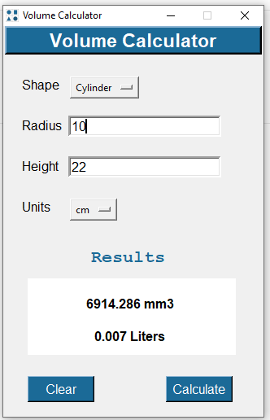

# SolidCal

 This calculator is to easily calculate the volume of geometric solids including a **Cylinder, Cone, Cuboid,** and **Sphere**.
 The input values can be given in multiple metric/units:  mm, cm, in, and the volume of every shape is calculated. 
User can select the desired shape from the Shape drop-down list and the entry fields will automatically configure as per input requirements for each mentioned shape. 
Application is built using Python programing language (3.10) and Tkinter framework for Graphical User Interface (GUI).
 
 
<!-- Badge section -->

<!----->

 

## Features
* Standard Calculator functionality offers basic operations and evaluates commands immediately as they are entered
* Multiple shapes and Metric/Unit operations
* Auto Liters conversion as per selected unit

 

## 🚀 Getting started

<b>Prerequisites</b> :

* Your computer must be running Python3 or newer.

* The script requires [Tkinter](https://docs.python.org/3/library/tkinter.html) library installed.  
   - Open Terminal and run `pip install tk` to install Tkinter library  
   
* Get the source [code](https://github.com/Abhijeetbyte/SolidCal/archive/refs/heads/main.zip)

* Extract the zip and open <b> main.py</b> in Python IDE to build and run the Calculator app. 
 
  **Windows users can download the binary release**
  
* Your computer must be running Windows 10 or newer.

* Install the latest version of the Application. [Download v1.2](https://github.com/Abhijeetbyte/SolidCal/releases/download/Version1.2/VolumeCalculator_setup.exe)
 

### `Input & Output Function`
 
#
* The units are shown for convenience but do not affect the calculations. The units  are in place to indicate the order of the result such as mm3,cm3, or Litres.

* Calculate the volume of a right circular cylinder given 2 known values.
  Enter height and radius and select the right shape, it will give you the volume.
  
   
  

## Reporting Issues & Contributions

Feel free to report <b>[issues](https://github.com/Abhijeetbyte/SolidCal/issues/new)</b> and <b>contribute</b> to this repository.

 

## License

Copyright © 2022 Abhijeet kumar. All rights reserved.

Licensed under the [CC0-1.0 License.](LICENSE)
