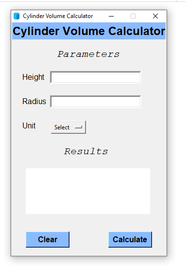
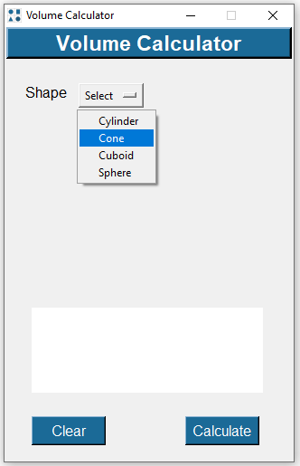
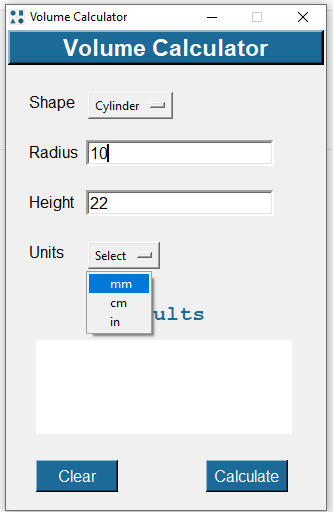
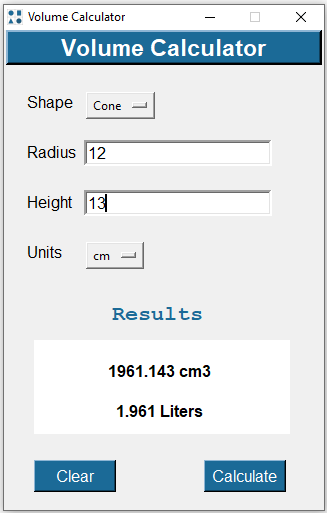
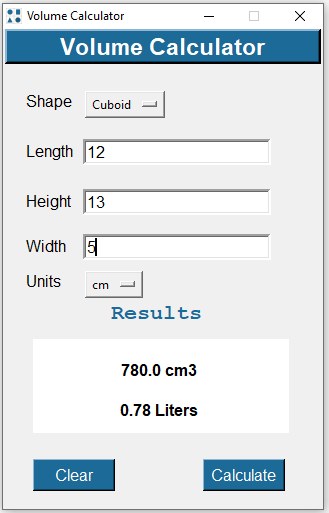
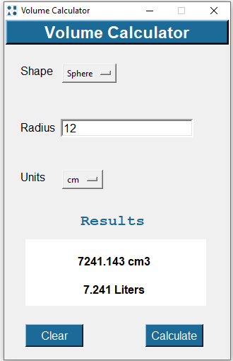

# Volume Calculator
#
### This calculator is to easily calculate the volume of geometric solids including a cylinder, cone, cuboid, sphere. The input values can be given multiple metric/unit:  mm, cm, in. The volume of every shape is calculated differently using different formulas.
### User can select the desired shape from the Shape drop-down list and the entry fields it automatically configures as per input requirements for each mentioned shape.
#
### Size : 12 mb 
### compatibility : Windows 10 or above
### [Download v1.1](https://github.com/4BH1J337/Cylinder-Volume-Calculator/releases/download/Version1.0/Cylinder.Volume.Calculator_setup.exe)
#

### After Installation Icon
#

#
### Program Execution
#

#
## Input & Output Function

### _Select Shape_

#
### _(i) Cylinder_

#
**_Calculate the volume of a right circular cylinder given 2 known values.
Enter height and radius and select the right shape, it will give you the volume._**
#
### _Units_

#
**_The units are shown for convenience but do not affect the calculations. The units  are in place to give an indication
of the order of the result such as mm3,cm3 or Litres._**
**_Unit Selection Feature with liters conversion as per selected unit_**
#
### _(ii) Cone_

#
**_Calculate the volume of a cone given 2 known values._**
#
### _(iii) Cuboid/Rectangular box_

#
**_Enter any 3 variables for a cuboid into the calculator by selecting the right shape option and it will give you the volume of the same._**
#
### _(iv) Sphere_

#
**_Calculate the volume of a sphere given 1 known value (radius)._**
#

